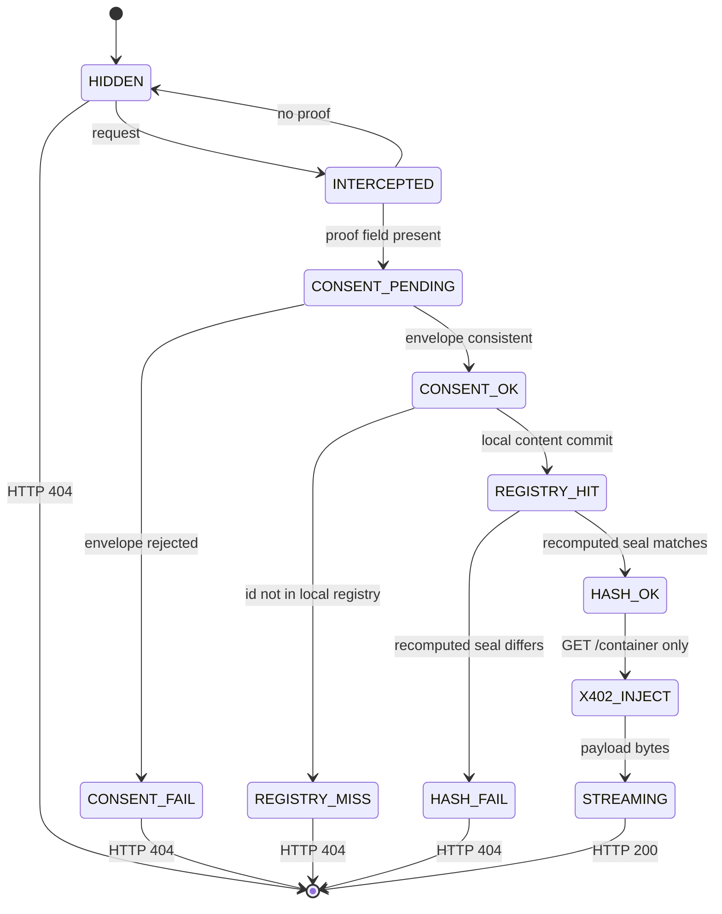

# SENTINEL.md — x404 Sentinel rule engine

This file is the interface contract for the x404 Sentinel proxy. An agent that can read only this document can call the service, mint a compatible 448-byte key, and interpret telemetry. The Go module `github.com/masterledgerlive/x404-sentinel` implements the contract. A disagreement between this file and the code is a defect in the code.

The proxy is a standalone process. It keeps a local content-addressed registry. It does not import sibling applications, and it does not anchor commits to Base or any other chain. Registry keys are `sha256` digests and stacked-DRG analog commits of files this repository actually holds.

## 1. Identity

| Field | Value |
| --- | --- |
| Service | `x404-sentinel` |
| Module | `github.com/masterledgerlive/x404-sentinel` |
| Version | `1.0.0` |
| Default listen | `:18080` |
| Chain | `none` |
| Commits | `local-sha256` |
| PHI | never stored; every registry document says `"phi": false` and `"classification": "NOT-PHI"` |

## 2. Forbidden functions

These functions do not exist. Do not add them. Do not imitate them in a client.

| Forbidden | Why |
| --- | --- |
| `StorePHI`, `PutPatient`, `PutMRI` | This process stores no protected health information, names, medical record numbers, or medical images. |
| `InventTxHash`, `AnchorBase`, `SubmitChain` | No blockchain transaction hash is created or cited. Local file commits are the only keys. |
| `MergeSibling`, `ImportVita`, `ImportGarden` | The module does not import or call any project outside `x404-sentinel/`. |
| `ServeBytesOnFailure` | A failed solve writes JSON only. Payload bytes are written only after `HASH_OK`, inside `Execute_x402_Injection`. |
| `AutoUnlock` | `GET /container/{id}` without a proof stays `HIDDEN` / HTTP 404. The UI must not request that route until the operator clicks Solve. |
| `Return402Invoice` | x402 injection is the name of the authenticated byte release. Success is HTTP 200. The proxy does not mint a payment invoice. |
| `RegisterDICOM` | A buffer with ASCII `DICM` at offset 128 is refused at build time. |

## 3. Fail-closed rules

1. The resting state of every container is `HIDDEN`. The HTTP status for a hidden container is **404**.
2. The response body on every failure is a small JSON document. It never contains payload bytes, the 448-byte key, or a stack trace.
3. A proof is accepted only when all of the following hold, in order: it decodes to exactly 448 bytes, `Verify_ZK_Consent` accepts the envelope, the id is in the local registry, and `HashCheck` recomputes the same seal from the file.
4. A structurally valid key minted over different bytes is `CONSENT_OK` then `HASH_FAIL`, and the status stays 404.
5. A cell key (`kind = 1`) does not unlock `GET /container/{id}`. Only the seal (`kind = 2`) does.
6. Telemetry `detail` strings are the constants in section 10. They do not include the proof or the payload.
7. `GET /registry/{id}` returns hashes, sizes, and labels. It does not return payload bytes or key bytes.
8. If the id contains a slash or fails the id grammar, the JSON `id` field is `""`.

Id grammar: `^[A-Za-z0-9][A-Za-z0-9._-]{0,63}$`. A 64-character sha256 hex string matches and is an alternate registry key (case-insensitive). The canonical id is the string stored at registration, for example `apollo11-sstv`.

## 4. State machine

Resting state, before any request: `HIDDEN` (HTTP 404, no body has been requested).

A retrieval attempt (`GET /container/{id}` or `POST /consent`) emits `INTERCEPTED` as its first event. `HIDDEN` is emitted again only when that attempt presented no proof.



`POST /consent` stops at `HASH_OK` (HTTP 200 JSON) or at a failure terminal (HTTP 404 JSON). It does not emit `X402_INJECT` or `STREAMING` and it does not write payload bytes.

`GET /container/{id}` emits `X402_INJECT` then writes the body, then emits `STREAMING`, only after `HASH_OK`.

Emitted success sequence for `GET /container/{id}`:

```
INTERCEPTED
CONSENT_PENDING
CONSENT_OK
REGISTRY_HIT
HASH_OK
X402_INJECT
STREAMING
```

Emitted sequence when the proof field is absent:

```
INTERCEPTED
HIDDEN
```

Emitted sequence when the proof field is present but the envelope is bad:

```
INTERCEPTED
CONSENT_PENDING
CONSENT_FAIL
```

Emitted sequence when the envelope is consistent and the seal does not match the file:

```
INTERCEPTED
CONSENT_PENDING
CONSENT_OK
REGISTRY_HIT
HASH_FAIL
```

Emitted sequence when the envelope is consistent and the id is unknown:

```
INTERCEPTED
CONSENT_PENDING
CONSENT_OK
REGISTRY_MISS
```

## 5. Visual hooks

`Emit_Agentic_Telemetry` forces `visual_hook` from this table. A caller-supplied hook that disagrees is discarded.

| State | visual_hook | UI animation |
| --- | --- | --- |
| `HIDDEN` | `agent-intercept` | red beacon pulse; the screen plate stays 404 |
| `INTERCEPTED` | `agent-intercept` | red beacon pulse |
| `CONSENT_PENDING` | `agent-verify` | verify rings rotate |
| `CONSENT_OK` | `agent-verify` | verify rings hold |
| `CONSENT_FAIL` | `agent-verify` | verify rings marked failed |
| `REGISTRY_HIT` | `agent-registry` | cell grid scans |
| `REGISTRY_MISS` | `agent-registry` | cell grid marked failed |
| `HASH_OK` | `agent-unlock` | latch opens |
| `HASH_FAIL` | `agent-unlock` | latch stays shut, marked failed |
| `X402_INJECT` | `agent-inject` | packets move toward the screen |
| `STREAMING` | `agent-inject` | packets move into the screen; video may play |

The page at `GET /` and `GET /ui` binds each hook to a CSS animation of the same name (`@keyframes agent-intercept`, and the same for `agent-verify`, `agent-registry`, `agent-unlock`, `agent-inject`). The video element has `preload="none"` and no `src` until the operator clicks Solve.

## 6. The 448-byte cell key

Function: `Mint(Material) ([]byte, error)` and `Structural(proof) error` in `internal/zk`. HTTP calls them through `Verify_ZK_Consent(proof_payload) (ok bool, reason string)`.

The key is a constant-size authorization transcript. The width matches the class of a zk-SNARK proof (a few hundred bytes, independent of the payload). It is a stacked commitment lock over `sha256(payload)`, the previous commit, and the origin label. It is not a Groth16 or PLONK proof: there is no circuit, no trusted setup, and no hiding property. The payload hash is inside the transcript. A party who has the file can recompute the key. Do not use it as a production zero-knowledge proof, and do not use it for real PHI.

`Verify_ZK_Consent` checks the envelope only. `reason` is `ok`, `empty`, `length`, `magic`, `version`, `kind`, `binding`, or `transcript`. The HTTP layer collapses every non-`ok` reason to `proof_malformed` and does not echo which check failed in a way that returns bytes. HTTP `detail` for that case is the fixed string `consent key rejected`.

### Layout

All integers are big-endian. Offsets are in bytes.

| Offset | Length | Field |
| --- | --- | --- |
| 0 | 8 | Magic ASCII `X404KEY1` |
| 8 | 2 | Version `uint16 = 1` |
| 10 | 2 | Kind `uint16`: `1` cell, `2` seal |
| 12 | 4 | Cell index `uint32`. Seal uses `0xFFFFFFFF` |
| 16 | 4 | Cell count `uint32` (data cells only) |
| 20 | 4 | Chunk length `uint32` (length of the bytes hashed into chunk sha256) |
| 24 | 32 | `sha256(payload)` where payload is the full container |
| 56 | 32 | Previous commit. 32 zero bytes for cell 0. For a later cell, the previous cell's stacked commit. For the seal, the last cell's stacked commit. |
| 88 | 32 | Origin commit |
| 120 | 32 | `sha256(chunk)`. For a seal, chunk is the full payload, so this equals the payload hash. |
| 152 | 32 | Stacked-DRG analog commit of this cell, or of the grouped cell commits for a seal |
| 184 | 32 | Id commit |
| 216 | 32 | Binding |
| 248 | 192 | Transcript: six SHA-256 blocks |
| 440 | 8 | Tail: first 8 bytes of the tail hash |
| 448 | | end |

### Domain-separated hashes

Each hash is SHA-256. The domain string includes the trailing NUL byte.

```
origin  = SHA256( "x404-sentinel/v1/origin\x00"      || origin_utf8 )
id      = SHA256( "x404-sentinel/v1/id\x00"          || id_utf8 )
bind    = SHA256( "x404-sentinel/v1/bind\x00"        || key[0:216] )
T[i]    = SHA256( "x404-sentinel/v1/transcript\x00"  || byte(i) || bind || payload_sha || prev || origin || stacked )
tail    = SHA256( "x404-sentinel/v1/tail\x00"        || T[0] || T[1] || T[2] || T[3] || T[4] || T[5] )
key[248+32*i : 248+32*i+32] = T[i] for i in 0..5
key[440:448] = tail[0:8]
```

`Structural` recomputes binding and the transcript from the key bytes and compares them in constant time. `HashCheck` recomputes the whole seal from the file and compares it in constant time. A length mismatch is a failure. No payload is released on failure.

### Seal versus cell

Cells are groups of at most **4096** bytes (`cell_bytes`). The last cell may be shorter. Each cell has its own 448-byte key (`kind = 1`) whose `prev` chains to the previous cell's stacked commit.

The seal (`kind = 2`, index `4294967295`) is the key a client must present to `GET /container/{id}` and `POST /consent`. Its chunk is the full payload. Its stacked field is `Stack(concat(cell_stacked_commits), last_cell_stacked, 0xFFFFFFFF)`.

Mint inputs that are empty id, empty origin, bad kind, zero cell count, or a prev/stacked value that is not 32 bytes return an error and no key.

## 7. Stacked DRG analog

Function: `Stack(chunk, prev, index) ([]byte, error)` in `internal/drg`.

This is an iterated neighbor-mix commitment. Rounds are a fixed hash parameter (`Rounds = 4`). Node width is 32 bytes. It is an analog of a stacked depth-robust graph. It is not Filecoin SDR, NSE, or Proof-of-Replication, and it does not use Filecoin parameters.

`prev` must be exactly 32 bytes or the function returns an error and no digest.

```
n = 1 if chunk is empty, else ceil(len(chunk) / 32)
block[i] = chunk[i*32 : i*32+32] with the tail zero-padded to 32 bytes
          (an empty chunk is one all-zero block; padding is not stored)

L0[i] = SHA256(
  "x404-sentinel/v1/drg/L0\x00" ||
  uint32be(index) || uint32be(i) || prev || block[i]
)

for r in 0..3:
  stride = 1 + (r+1) * (n/3 + 1)     # integer division
  for i in 0..n-1:
    left = (i + n - 1) mod n
    jump = (i + stride) mod n
    next[i] = SHA256(
      "x404-sentinel/v1/drg/Lr\x00" ||
      byte(r) || uint32be(i) || L[i] || L[left] || L[jump]
    )
  L = next

root = SHA256(
  "x404-sentinel/v1/drg/ROOT\x00" ||
  uint32be(len(chunk)) || uint32be(index) || uint32be(n) ||
  prev || L[0] || L[1] || ... || L[n-1]
)
```

Golden vector: `Stack([]byte("abc"), 32 zero bytes, index 0)` =

```
efbcb6db5e68078ab430d872b70e94d8b3f2971c49ec17fb60e074ab16de9f4f
```

## 8. Registry document

`Query_x404_Registry(hash)` looks up `hash` as a canonical id or as the sha256 hex of the payload. On a hit the HTTP body is exactly this object (`phi` is always `false`, `classification` is always `NOT-PHI`):

```json
{
  "id": "apollo11-sstv",
  "sha256": "<64 lowercase hex>",
  "size": 76211,
  "mime": "video/webm",
  "origin": "nasa-pd-usgov",
  "label": "NASA PD-USGov Apollo 11 television, SSTV-style 160x120 10fps derivative",
  "phi": false,
  "synthetic": false,
  "classification": "NOT-PHI",
  "cell_bytes": 4096,
  "cell_count": 19,
  "stacked_root": "<64 lowercase hex>",
  "seal_index": 4294967295,
  "cells": [
    {
      "index": 0,
      "offset": 0,
      "length": 4096,
      "sha256": "<64 lowercase hex>",
      "prev": "<64 lowercase hex, 64 zeroes for cell 0>",
      "stacked": "<64 lowercase hex>"
    }
  ]
}
```

`cell_count` for the current Apollo file is 19 (18 cells of 4096 bytes and a final cell of 2483 bytes). Clients must read `cell_count` from this document rather than assume it after the file changes.

There is no `bytes`, `proof`, `proofHex`, `key`, or `tx` field.

## 9. HTTP endpoints

Common response headers on JSON and on the stream: `Cache-Control: no-store`, `X-Content-Type-Options: nosniff`, `Referrer-Policy: no-referrer`.

JSON status object (failures, and `POST /consent` success):

```json
{
  "ok": false,
  "reason": "sealed",
  "state": "HIDDEN",
  "id": "apollo11-sstv",
  "detail": "container is hidden until a consent key is presented"
}
```

`reason` and `state` are the stable machine names. `detail` is the fixed string from section 10.

### Endpoint table

| Method | Path | Success | Failure | Body |
| --- | --- | --- | --- | --- |
| `GET` | `/health` | 200 | 405 | health JSON |
| `GET` | `/container/{id}` | 200 stream | 404 JSON | payload bytes only on success |
| `POST` | `/consent` | 200 JSON `hash_ok` | 404 JSON, or 400 `bad_request` | status JSON, never payload |
| `GET` | `/registry/{id}` | 200 metadata | 404 `registry_miss` | metadata JSON |
| `GET` | `/telemetry` | 200 | 405 | `{"events":[...]}` |
| `GET` | `/` | 200 | 405 | `public/index.html` |
| `GET` | `/ui` and `/ui/` | 200 | 405 | `public/index.html` |
| `GET` | `/media/{file}` | 200 | 404 | one file from `public/` |
| any | any other path | | 404 `not_found` | status JSON |
| wrong method | a known path | | 405 `method_not_allowed` | status JSON |

`GET /media/{file}` allows one path segment that matches the id grammar. `..` is rejected. The demo seal hex is `public/apollo11-sstv.proof.hex`, fetched as `/media/apollo11-sstv.proof.hex`. That file is public because the Apollo footage is public-domain television. The MRI-SHIM seal is not published under `public/`.

### `GET /health`

```json
{
  "status": "ok",
  "service": "x404-sentinel",
  "version": "1.0.0",
  "phi": false,
  "chain": "none",
  "commits": "local-sha256"
}
```

No telemetry event.

### `GET /container/{id}`

Proof, in order:

1. If the header `X-Sentinel-Proof` is present, it is the proof. The query is ignored, even when the header is empty.
2. Otherwise if the query parameter `proof` is present, it is the proof.
3. Otherwise the attempt is `HIDDEN` / `sealed`.

Hex rules: trim space, ignore a single leading `0x` or `0X`, ignore inner ASCII whitespace, decode hex (either case). Decoded length must be 448. Anything else is `proof_malformed` / `CONSENT_FAIL`.

Success headers, set before the first payload byte:

| Header | Value |
| --- | --- |
| `Content-Type` | registry `mime` (`video/webm` or `application/octet-stream`) |
| `Content-Length` | payload size |
| `X-X402-Injection` | `stream` |
| `X-Sentinel-State` | `STREAMING` |
| `X-Sentinel-Container` | canonical id |
| `X-Content-SHA256` | lowercase sha256 of the payload |
| `Content-Disposition` | `inline; filename="<id>"` |

The body is the concatenation of the grouped cells, which equals the registered file. `X-X402-Injection` is absent on every error.

Failure reasons for this route:

| reason | state | detail |
| --- | --- | --- |
| `sealed` | `HIDDEN` | `container is hidden until a consent key is presented` |
| `proof_malformed` | `CONSENT_FAIL` | `consent key rejected` |
| `registry_miss` | `REGISTRY_MISS` | `no local content commit` |
| `hash_fail` | `HASH_FAIL` | `stacked commitment rejected` |

### `POST /consent`

Request `Content-Type: application/json`, at most 64 KiB. The object has exactly two fields:

```json
{
  "id": "apollo11-sstv",
  "proofHex": "<hex of the 448-byte seal>"
}
```

Extra fields, a second JSON value, or a body that is not that object: HTTP 400.

```json
{
  "ok": false,
  "reason": "bad_request",
  "state": "CONSENT_FAIL",
  "id": "",
  "detail": "consent body must be a JSON object with id and proofHex"
}
```

An omitted or blank `proofHex` is `sealed` / `HIDDEN` / HTTP 404, the same as a container request with no proof. This route does not read `X-Sentinel-Proof`.

Success:

```json
{
  "ok": true,
  "reason": "hash_ok",
  "state": "HASH_OK",
  "id": "apollo11-sstv",
  "detail": "stacked commitment matched"
}
```

### `GET /registry/{id}`

Hit: HTTP 200 and the metadata object in section 8. One telemetry event `REGISTRY_HIT` / `agent-registry`.

Miss or invalid id: HTTP 404, `reason=registry_miss`, `state=REGISTRY_MISS`, `detail=no local content commit`. One telemetry event `REGISTRY_MISS`.

### `GET /telemetry`

```json
{
  "events": [
    {
      "seq": 1,
      "ts": "2026-09-21T19:00:00.000000000Z",
      "state": "INTERCEPTED",
      "visual_hook": "agent-intercept",
      "container_id": "apollo11-sstv",
      "ok": false,
      "detail": "404 intercepted"
    }
  ]
}
```

`seq` starts at 1 and increases by 1. `ts` is UTC RFC3339Nano. The ring keeps 256 events, oldest first in this array. This route does not append an event. The server also writes each event as one JSON line on stderr when it is started from `cmd/sentinel`.

### Detail strings

| detail | when |
| --- | --- |
| `404 intercepted` | `INTERCEPTED` |
| `container is hidden until a consent key is presented` | `HIDDEN` |
| `consent key presented; verifying envelope` | `CONSENT_PENDING` |
| `consent envelope accepted` | `CONSENT_OK` |
| `consent key rejected` | `CONSENT_FAIL` |
| `local content commit found` | `REGISTRY_HIT` |
| `no local content commit` | `REGISTRY_MISS` |
| `stacked commitment matched` | `HASH_OK` |
| `stacked commitment rejected` | `HASH_FAIL` |
| `x402 injection started` | `X402_INJECT` |
| `bytes streaming` | `STREAMING` |
| `consent body must be a JSON object with id and proofHex` | HTTP 400 |
| `method not allowed` | HTTP 405 |
| `no such route` | unknown path |

## 10. Telemetry function

```
Emit_Agentic_Telemetry(state, visual_hook, meta) -> Event
meta.container_id  string
meta.detail        string
meta.ok            bool
```

`visual_hook` is replaced by section 5. `ok` is true for `CONSENT_OK`, `REGISTRY_HIT`, `HASH_OK`, `X402_INJECT`, and `STREAMING`.

## 11. Fixtures

| id | file | origin | mime | synthetic |
| --- | --- | --- | --- | --- |
| `apollo11-sstv` | `testdata/apollo11-sstv.webm` | `nasa-pd-usgov` | `video/webm` | false |
| `mri-shim` | `testdata/mri-shim.bin` | `synthetic-not-phi` | `application/octet-stream` | true |

Grouped cells and 448-byte keys are filed under `testdata/cells/<id>/` as `cell-NNNN.bin`, `cell-NNNN.key`, `seal.key`, and `MANIFEST.json`. The manifest stores `sha256` of each key, not the key. The process refuses to listen if those files disagree with a fresh build of the fixture bytes.

`mri-shim.bin` is ASCII. It is a dummy placeholder labeled `NOT-PHI`. It is not a medical image. The live retrieval proof is `apollo11-sstv`.

License, source URL, and hashes for the Apollo derivative are in `testdata/CATALOG.md`. Current derivative: sha256 `2c319d60ead708a34c18f93cc3259a5664f7174076a6ff57a5c525d5cce76eb0`, 76211 bytes, 160×120, 10 fps, 4.00 s, VP9, no audio.

## 12. Worked vector

Payload: ASCII `sentinel-vector` (15 bytes). Origin: `nasa-pd-usgov`. Id: `vector`. Kind: cell. Index: 0. Cell count: 1. Prev: 32 zero bytes. Stacked commit of that single chunk:

```
f932b11aa70d799311e4313bcd717f1d979525de176c4bd2f0b3df79a02d6ae1
```

448-byte key, lowercase hex, no whitespace:

```
583430344b4559310001000100000000000000010000000f25cee4a003c295ee844a801085cacde5c1a746c59e57870363fed3df5d9d150d0000000000000000000000000000000000000000000000000000000000000000c77d7ebf7b5191e5d519fb9a9e1cc37fc85f05cde610087764d656b4aef82b6625cee4a003c295ee844a801085cacde5c1a746c59e57870363fed3df5d9d150df932b11aa70d799311e4313bcd717f1d979525de176c4bd2f0b3df79a02d6ae1261272c5c3c85f11f1153dcc42c7438f72c344673966152608da25b614424dcf3e14dd9b24db5cf5fc90b8e55c3d6f9b2395a10179cb08f0f7c1b7e5b2cfb8a4cd14b07c64df6604583e8e0673152e5b4cc3992f9e5a1b15c087db0d576f9d2e48ec57262d819bf841718b6076a502eee14f3927ef66b12c1a54b90afb5520a0d11aa5d68eda2b7e3c1fd66c7976503d88426efc36c31917000f08d3a33bc681e052128eec713bd019763c48e0312030036670c6ac2902ab5b00317b3dc5754bd81bd365dd3b00e7d558926b48393af95ae9f1eb03fded064e6dc30dbeb0bf001c861f1e6ee63b095e405689b7f5f25de9817451d9c93e131a1534ed6d18faba3f2833d95c982ec6
```

The ASCII payload does not appear inside that key.

## 13. Client procedure for the Apollo proof

```
GET /container/apollo11-sstv
  → 404 {"ok":false,"reason":"sealed","state":"HIDDEN",...}
    and the body is not a WebM file

POST /consent
  {"id":"apollo11-sstv","proofHex":"<seal hex>"}
  → 200 {"ok":true,"reason":"hash_ok","state":"HASH_OK",...}

GET /container/apollo11-sstv
  header X-Sentinel-Proof: <seal hex>
  → 200 video/webm
    sha256 of the body = 2c319d60ead708a34c18f93cc3259a5664f7174076a6ff57a5c525d5cce76eb0

GET /container/apollo11-sstv
  header X-Sentinel-Proof: <any other key>
  → 404 and the body is not a WebM file
```

Mint the seal from the local file with `go run ./cmd/sentinel -mint apollo11-sstv` (stdout is the hex and a newline). The demo page loads the same hex from `/media/apollo11-sstv.proof.hex` only after the operator clicks Solve, then performs the POST and the GET above. It does not set a video `src` to `/container/...`.
