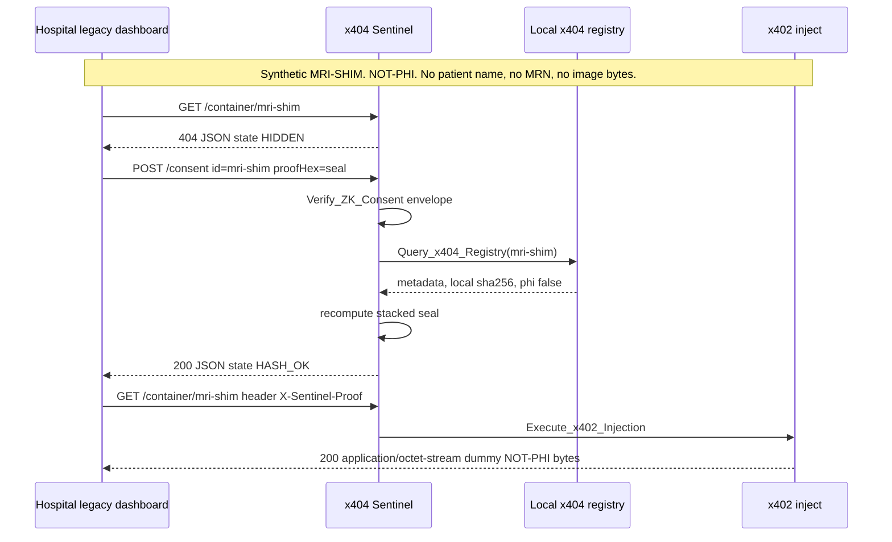
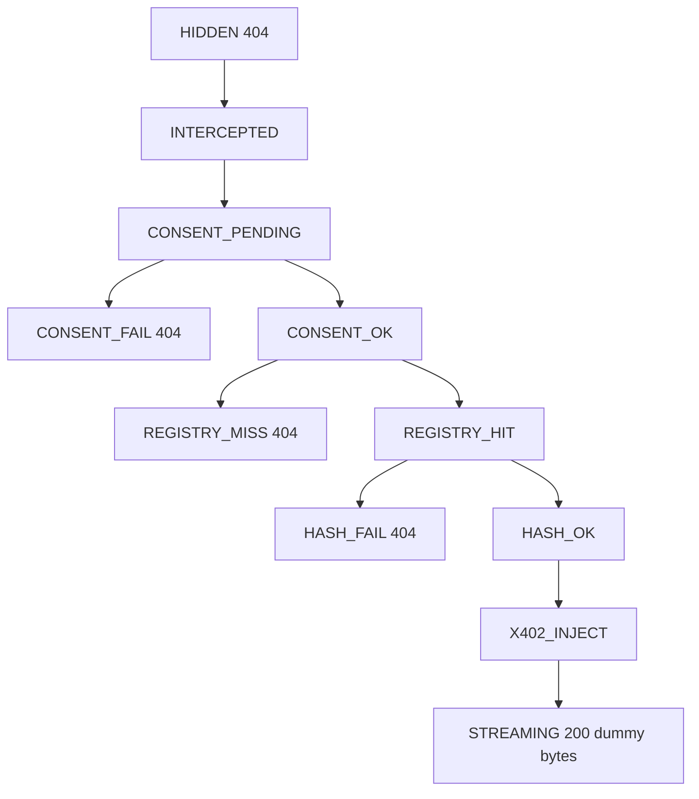

# Medical blueprint — synthetic, NOT-PHI

This document is an architecture sketch. It describes how a hospital dashboard could ask x404 Sentinel for a sealed object. **The software in this directory does not store or generate patient data.** There are no names, no medical record numbers, and no medical images.

The only clinical-looking id is `mri-shim`. Its bytes are the ASCII file `testdata/mri-shim.bin`, labeled `NOT-PHI`. The registry marks it `"synthetic": true`, `"phi": false`, `"classification": "NOT-PHI"`. The origin string is `synthetic-not-phi`. Build rejects a buffer that carries the DICOM marker `DICM` at offset 128.

The retrieval that this repository actually proves is NASA public-domain Apollo 11 television (`apollo11-sstv`), documented in `testdata/CATALOG.md`.

The consent key is a 448-byte local transcript. It is not written to a chain. The health route reports `"chain": "none"` and `"commits": "local-sha256"`. A production zero-knowledge proof that hides the content hash is out of scope; the reference key embeds `sha256(payload)` so the proxy can fail closed. That is a reason to keep real PHI out of this process.

## Actors

| Actor | Role in the sketch |
| --- | --- |
| Hospital legacy dashboard | Sends the same HTTP calls as any other client |
| x404 Sentinel | Turns HTTP 404 into a stream only after the seal matches |
| Local x404 registry | Content-addressed metadata for `mri-shim` |
| x402 inject | Writes the dummy bytes after `HASH_OK` |

No identity string and no image bytes are placed on a ledger. The registry key is the sha256 of the local dummy file.

## Sequence

A failed proof stops on the 404 branch. The response JSON has `ok: false` and does not contain the dummy file.

## State machine on the synthetic id

Telemetry `visual_hook` values on that path are `agent-intercept`, `agent-verify`, `agent-registry`, `agent-unlock`, and `agent-inject`. A dashboard skin can animate those names. The Apollo page in `public/index.html` is the working example, and it plays the public-domain television clip rather than the shim.

## What a deployment would still have to add

A real clinical deployment would replace this reference transcript with a zero-knowledge proof that does not reveal the content hash, keep seal keys with the authorizing party, and refuse to register medical images. Those controls are not implemented here, because this repository is a blueprint plus a public-domain retrieval test.
